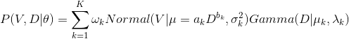
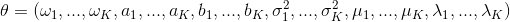
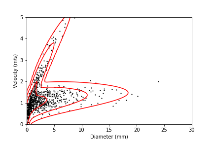
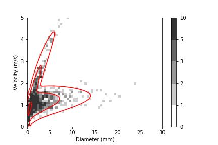

# Introduction

This software provides some classes and modules to fit the mixed joint probability density function (PDF) to precipitation particle diameter velocity distribution (PSVD) data using the expectation maximization (EM) algorithm and their sample source codes.  
The supported languages are now Python, C++, and fortran.  

In the fitting algorithm, we assume a mixed joint PDF of diameter ("D") and velocity ("V"):  
  
, where  
  
Here, "ω" is a mixing fraction, "a" and "b" are parameters of the velocity-diameter relationship  
  
, "σ2" is a variance of velocity distribution assumed as the Normal distribution, "μ" and "λ" is respectively the shape and slope parameter of the diameter distribution assumed as the Gamma distribution, and "K" is the number of PDF elements. The fitting algorithm can provide the optimal parameter set of "θ" giving the number of PDF elements.

Please see [Katsuyama and Inatsu (2020)](https://doi.org/10.1175/JTECH-D-19-0150.1) for details of the algorithm.

# Licence and agreement

The source codes is distributed under the [MIT license](https://opensource.org/licenses/MIT).  
You must cite [Katsuyama and Inatsu (2020)](https://doi.org/10.1175/JTECH-D-19-0150.1) in an appropriate way when you present and/or publish scientific results and products using this fitting algorithm.

Katsuyama, Y., and M. Inatsu, 2020: Fitting precipitation particle size-velocity data to mixed joint probability density function with an expectation maximization algorithm, J. Atmos. Oceanic Tech., doi: [10.1175/JTECH-D-19-0150.1](https://doi.org/10.1175/JTECH-D-19-0150.1), accepted.

# For python users

## Requirements

The python module requires followings.

1. [Python3](https://www.python.org/)
2. [Numpy](https://pypi.org/project/numpy/)
3. [Scipy](https://pypi.org/project/scipy/)
4. [pybind11](https://pypi.org/project/pybind11/) (if your environment supports C++11.)
5. [Eigen3](http://eigen.tuxfamily.org/) (if your environment supports C++11.)

## Installation

If your environment supports C++11, you can install the python module implemented with C++ by following commands after installing Eigen3.  
\* Please replace the software version ("1.0" in this document) with an appropriate version.

```
$ pip3 install pybind11
$ wget https://humet.sci.hokudai.ac.jp/~katsuyama/em-psvd/EM-PSVD-1.0.zip
$ unzip EM-PSVD-1.0.zip
$ cd EM-PSVD-1.0
$ pip3 install . --user
```

C/C++ compiler can be optionally specified with the environment variables of `CC` and `CXX` as follow.

```
$ CC=/usr/local/bin/gcc CXX=/usr/local/bin/g++ pip3 install . --user 
```

\* We have only tested with the C/C++ compiler of gcc (GCC) 4.9.4, so the source codes have not been confirmed to work with the other C/C++ compilers.

If your environment does not support C++11, the python module implemented with pure python can be installed by following commands.

```
$ wget https://humet.sci.hokudai.ac.jp/~katsuyama/em-psvd/EM-PSVD-1.0.zip
$ unzip EM-PSVD-1.0.zip
$ cd EM-PSVD-1.0
$ ENABLE_CXX=OFF pip3 install . --user
```

Or, you can use the module by simply putting [pyempsvd.py](python/pyempsvd.py) in an install directory.

## Demonstration

A demonstration has been prepared in [sample/python](sample/python): [psvd.py](sample/python/psvd.py) and [psvd_bin.py](sample/python/psvd_bin.py) provides a demonstration for pure PSVD data and a demonstration for binned PSVD data, respectively. First, please go to the sample directory.

```
$ cd sample/python
```

Then, we explain the usage of class following the demonstrations.

### A case for pure PSVD data

Here is a case for fitting to pure PSVD data, included at [sample/data/psvd.csv](sample/data/psvd.csv). This sample data contains diameter (mm) and velocity (m/s) at first and second column, respectively. Therefore, the PSVD can be illustrated as follow.


```Python
import numpy as np
import matplotlib.pyplot as plt
data = np.loadtxt("../data/psvd.csv", delimiter=",", dtype=float, comments="#")
plt.scatter(
    data[:, 0], data[:, 1], c="k", s=5, marker="."
)
plt.xlim([0, 30])
plt.ylim([0, 5])
plt.xlabel("Diameter (mm)")
plt.ylabel("Velocity (m/s)")
plt.show()
```


To fit this PSVD data, a `EmpsvdCore` object is firstly constructed.

```python
from pyempsvd import EmpsvdCore
em = EmpsvdCore(
    2, data[:, 0], data[:, 1]
)
```

In this case, the object has been constructed with the number of PDF elements `K=2`, specified at the first argument. The second and third argument is respectively diameter and velocity of data. In this case, the initial parameters has been automatically generated using `EmpsvdCore.make_theta0`, a static method to generate an initial parameter set based on the PSVD data given.  

If you would like to specify an initial parameter set explicitly, you can use a keyword argument `theta0`.

```python
theta0 = np.array([
    # omega, a, b, sigma2 (m^2 s^-2), mu+1, lambda (mm^-1) 
    [0.5, 0.3, 0.2, 0.04, 2.5, 0.1],  # 1st PDF element
    [0.5, 1.0, 0.8, 0.04, 2.5, 0.1]   # 2nd PDF element
])
em = EmpsvdCore(
    2, data[:, 0], data[:, 1], theta0=theta0
)
```

`theta0` must be an numpy ndarray with a shape of (K, 6) containing parameters for each PDF element with an order of ω, a, b, σ2, μ+1, and λ.  
As the other keyword arguments, the followings can be listed.

* tol: a tolerance parameter for the convergence judgement based on log-likelihood.
* max_iter: a maximum number of iteration in the fitting.
* fix_ab: parameters a and b are not updated from the initial state in the fitting if true.
* fix_alpha: a parameter μ is not updated from the initial state in the fitting if true.

Once the EmpsvdCore object has been constructed, the fitting can be easily done by calling `fit` method.

```python
em.fit()
```

If the fitting has been successfully done, the optimal parameters set can be obtained by `em.theta` as a numpy ndarray.

```python
print(em.theta)
# [[0.68021269 0.94695267 0.15121241 0.07125975 0.97823976 0.3087228 ]
#  [0.31978731 1.27793059 0.66705588 0.0727024  1.27689841 0.82836992]]
```

Otherwise, `RuntimeError` will be raise. The shape and element order are same as `theta0`.  
The fitting result can be illustrated as follow.

```python
plt.scatter(
    em.x, em.y, c="k", s=5, marker="."
)
x = np.linspace(0.01, 30, 100)
y = np.linspace(0.01, 5, 100)
xx, yy = np.meshgrid(x, y)
plt.contour(
    xx, yy, em.calc_pxy(xx, yy, em.theta).sum(axis=-1), 
    levels=[0.001, 0.01, 0.1], colors="r"
)
plt.xlim([0, 30])
plt.ylim([0, 5])
plt.xlabel("Diameter (mm)")
plt.ylabel("Velocity (m/s)")
plt.show()
```



Here, `calc_pxy` method returns probability density of each PDF element corresponding to diameter (=`xx` in this case) and velocity (=`yy` in this case), so that we need to sum up the all PDF elements by `.sum(axis=-1)` in order to display the mixed PDF.

### A case for binned PSVD data

Next is a case for fitting to binned PSVD data, included at [sample/data/psvd_bin.csv](sample/data/psvd_bin.csv). This sample data contains a number of particles (at third column) for a bin of diameter (at first column) and velocity (at second column), converted from [the pure PSVD data](sample/data/psvd.csv). The number of bins is 100 for diameter axis and 60 for velocity axis. The PSVD can be illustrated as follow.

```python
import numpy as np
import matplotlib.pyplot as plt
from matplotlib.colors import ListedColormap, BoundaryNorm
data = np.loadtxt("../data/psvd_bin.csv", delimiter=",", dtype=float, comments="#")
xx = data[:, 0].reshape(100, 60)
yy = data[:, 1].reshape(100, 60)
zz = data[:, 2].reshape(100, 60)
cmap = ListedColormap([[i/5] * 3 for i in range(5, 0, -1)])
bounds = [0, 1, 2, 3, 5, 10]
norm = BoundaryNorm(bounds, cmap.N)
plt.pcolor(
    xx, yy, zz, 
    cmap=cmap, norm=norm
)
plt.colorbar()
plt.xlim([0, 30])
plt.ylim([0, 5])
plt.xlabel("Diameter (mm)")
plt.ylabel("Velocity (m/s)")
plt.show()
```


For this binned PSVD data, the fitting can be done as following code.

```python
from pyempsvd import EmpsvdCore
mask = data[:, 2] > 0
em = EmpsvdCore(
    2, data[mask, 0], data[mask, 1], data[mask, 2]
)
em.fit()
```

Here, the EmpsvdCore object is constructed with the data where `z > 0` in order to avoid the zero division error. The fitting result is then illustrated as follow.

```python
xx = data[:, 0].reshape(100, 60)
yy = data[:, 1].reshape(100, 60)
zz = data[:, 2].reshape(100, 60)
cmap = ListedColormap([[i/5] * 3 for i in range(5, 0, -1)])
bounds = [0, 1, 2, 3, 5, 10]
norm = BoundaryNorm(bounds,cmap.N)
plt.pcolor(
    xx, yy, zz, 
    cmap=cmap, norm=norm
)
plt.colorbar()
x = np.linspace(0.01, 30, 100)
y = np.linspace(0.01, 5, 100)
xx, yy = np.meshgrid(x, y)
plt.contour(xx, yy, em.calc_pxy(xx, yy, em.theta).sum(axis=-1), levels=[0.001, 0.01, 0.1], colors="r")
plt.xlim([0, 30])
plt.ylim([0, 5])
plt.xlabel("Diameter (mm)")
plt.ylabel("Velocity (m/s)")
plt.show()
```



# For C++ users

## Requirements

The C++ class requires followings.

1. C++11
2. [Eigen3](http://eigen.tuxfamily.org/)

\* We have only tested with the gcc (GCC) 4.9.4, so the source codes have not been confirmed to work with the other compilers.

## Demonstration

A demonstration has been prepared in [sample/cpp](sample/cpp): [psvd.cpp](sample/cpp/psvd.cpp) and [psvd_bin.cpp](sample/cpp/psvd_bin.cpp) provides a demonstration for pure PSVD data and a demonstration for binned PSVD data, respectively.

```
$ wget https://humet.sci.hokudai.ac.jp/~katsuyama/em-psvd/EM-PSVD-1.0.zip
$ unzip EM-PSVD-1.0.zip
$ cd EM-PSVD-1.0/sample/cpp
```

\* Please replace the software version ("1.0" in this document) with an appropriate version.

To compile the demonstrations, please modify `Makefile` following your environment and run `make pre` and `make` commands.

```
$ make pre
$ make
```

Then, you can see the executable files, `psvd.exe` and `psvd_bin.exe`: `psvd.exe` is generated from `psvd.cpp` and `psvd_bin.exe` is generated from `psvd_bin.cpp`.  
Executing `psvd.exe`, fitting results for a sample pure PSVD data, [sample/data/psvd.csv](sample/data/psvd.csv), will be displayed on your console.

```
$ ./psvd.exe
---Initial States---
omega   a     b     sigma2     alpha(mu+1)    lambda
     0.5 0.303931        0 0.447839 0.786502 0.296983
     0.5  1.87269        1 0.447839 0.786502 0.296983
Loglikelihood: -3763.42
AIC: -3775.42
BIC: -3804.24
---Fitting Result----
omega   a     b     sigma2     alpha(mu+1)    lambda
 0.683394  0.946148  0.151896 0.0713072  0.973004  0.308272
 0.316606   1.27853  0.666832 0.0726836   1.28722  0.829519
Loglikelihood: -2131.81
AIC: -2143.81
BIC: -2172.62
Total iteration: 26
```

Similarly, executing `psvd_bin.exe`, fitting results for a sample binned PSVD data, [sample/data/psvd_bin.csv](sample/data/psvd_bin.csv), will be displayed on your console.

```
$ ./psvd_bin.exe
---Initial States---
omega   a     b     sigma2     alpha(mu+1)    lambda
     0.5 0.304083        0 0.449144 0.795394 0.298584
     0.5  1.85819        1 0.449144 0.795394 0.298584
Loglikelihood: -3770.13
AIC: -3782.13
BIC: -3803.47
---Fitting Result----
omega   a     b     sigma2     alpha(mu+1)    lambda
 0.652302  0.945889  0.151165 0.0729722   1.12825  0.341661
 0.347698   1.26561  0.670277 0.0847078   1.32228  0.901791
Loglikelihood: -2156.76
AIC: -2168.76
BIC: -2190.1
Total iteration: 22
```

The usage of C++ class is mostly same as the python case.  
First, construct `EmpsvdCore` object after diameter (=`x`) and velocity (=`y`) data is obtained.

```cpp
constexpr int ROWS = 900;
std::ifstream ifs("../data/psvd.csv");
Eigen::ArrayXd x(ROWS), y(ROWS);
Eigen::Index i = 0;
std::string buf, field;

if (!ifs.is_open()) {
    std::cerr << "No file is opened." << std::endl;
    return 0;
}
std::getline(ifs, buf);  // skip header
while (std::getline(ifs, buf)) {
    std::stringstream ss(buf);
    std::getline(ss, field, ','); x(i) = std::stod(field);
    std::getline(ss, field, ','); y(i) = std::stod(field);
    i++;		
}

Empsvd::EmpsvdCore em(2, x, y);
```

The fitting can be easily conduct by calling `em.fit()`.

```cpp
em.fit();
```

If the fitting has not been successfully done, `std::runtime_error` will be thrown. The fitting result can be contained in `em.theta` variable as well as the python case.

If the PSVD data is binned data, the code is slightly modified.

```cpp
constexpr int ROWS = 100 * 60;
std::ifstream ifs("../data/psvd_bin.csv");
Eigen::ArrayXd x_in(ROWS), y_in(ROWS), z_in(ROWS);
Eigen::Index i = 0;
std::string buf, field;

if (!ifs.is_open()) {
    std::cerr << "No file is opened." << std::endl;
    return 0;
}
std::getline(ifs, buf);  // skip header
while (std::getline(ifs, buf)) {
    std::stringstream ss(buf);
    std::getline(ss, field, ','); x_in(i) = std::stod(field);
    std::getline(ss, field, ','); y_in(i) = std::stod(field);
    std::getline(ss, field, ','); z_in(i) = std::stod(field);
    i++;
}

// extract elements where z > 0
Eigen::ArrayXd exist_data = (z_in.array() > 0.).select(					     
    Eigen::ArrayXd::Constant(z_in.size(), 1),
    Eigen::ArrayXd::Constant(z_in.size(), 0)
);
size_t n = exist_data.count();
Eigen::ArrayXd x(n), y(n), z(n);
Eigen::Index j = 0;
for (i = 0; i < x_in.size(); i++) {
        if (exist_data(i)) {
            x(j) = x_in(i);
        y(j) = y_in(i);
        z(j) = z_in(i);
        j++;
        }
}

Empsvd::EmpsvdCore em(2, x, y, z);
em.fit();
```

Please note that the elements where `z=0` should be removed in advance to construct `EmpsvdCore` object in order to avoid the zero division error.

# For fortran uesrs

## Requirements

The fortran module works under the standard fortran environment, fotran90/95. No special library is requred.  
\*  We have only tested with the GNU Fortran (GCC) 4.4.7, so the source codes have not been confirmed to work with the other compilers.

## Demonstration

A demonstration has been prepared in [sample/fortran](sample/fortran): [psvd.f90](sample/fortran/psvd.f90) and [psvd_bin.f90](sample/fortran/psvd_bin.f90) provides a demonstration for pure PSVD data and a demonstration for binned PSVD data, respectively.

```
$ wget https://humet.sci.hokudai.ac.jp/~katsuyama/em-psvd/EM-PSVD-1.0.zip
$ unzip EM-PSVD-1.0.zip
$ cd EM-PSVD-1.0/sample/fortran
```

\* Please replace the software version ("1.0" in this document) with an appropriate version.

To compile the demonstrations, please modify `Makefile` following your environment and run `make pre` and `make` commands.

```
$ make pre
$ make
```

Then, you can see the executable files, `psvd.exe` and `psvd_bin.exe`: `psvd.exe` is generated from `psvd.cpp` and `psvd_bin.exe` is generated from `psvd_bin.cpp`.  
Executing `psvd.exe`, fitting results for a sample pure PSVD data, [sample/data/psvd.csv](sample/data/psvd.csv), will be displayed on your console.

```
$ ./psvd.exe
----initial condition----
                    omega              a              b         sigma2    alpha(mu+1)         lambda
theta(1)=(        0.50000        0.30393        0.00000        0.44784        0.78650        0.29698)
theta(2)=(        0.50000        1.87269        1.00000        0.44784        0.78650        0.29698)
log-likelihood:     -3763.42345
           aic:     -3775.42345
           bic:     -3804.23782
----Fitting result----
                    omega              a              b         sigma2    alpha(mu+1)         lambda
theta(1)=(        0.68339        0.94615        0.15190        0.07131        0.97300        0.30827)
theta(2)=(        0.31661        1.27853        0.66683        0.07268        1.28722        0.82952)
number of iteration: 25
log-likelihood:     -2131.81060
           aic:     -2143.81060
           bic:     -2172.62497
```

Similarly, executing `psvd_bin.exe`, fitting results for a sample binned PSVD data, [sample/data/psvd_bin.csv](sample/data/psvd_bin.csv), will be displayed on your console.

```
$ ./psvd_bin.exe
----initial condition----
                    omega              a              b         sigma2    alpha(mu+1)         lambda
theta(1)=(        0.50000        0.30408        0.00000        0.44914        0.79539        0.29858)
theta(2)=(        0.50000        1.85819        1.00000        0.44914        0.79539        0.29858)
log-likelihood:     -3770.12933
           aic:     -3782.12933
           bic:     -3803.47030
----Fitting result----
                    omega              a              b         sigma2    alpha(mu+1)         lambda
theta(1)=(        0.65230        0.94589        0.15117        0.07297        1.12825        0.34166)
theta(2)=(        0.34770        1.26561        0.67028        0.08471        1.32228        0.90179)
number of iteration: 21
log-likelihood:     -2156.75916
           aic:     -2168.75916
           bic:     -2190.10013
```

The usage of fortran module is mostly same as the python and C++ cases. First, please initialize the module by calling `init` subroutine after diameter (=`x`) and velocity (=`y`) data is obtained.

```f90
use empsvd_core, only: init, fit, theta
implicit none
integer(8), parameter :: N=900, K=2
real(8) :: x(N), y(N), r
integer(8) :: i, info

! read PSVD data
open(10, file="../data/psvd.csv", status="old")
read(10, *)  ! skip header
do i = 1, N
    read(10, *) x(i), y(i)
end do
close(10)

! initialize the module
call init(K, x, y)
```

The fitting can be easily done by calling `fit` function.

```f90
call fit(info)
```

If the fitting has been successfully done, `info` will be `0`. The fitting result is contained in `theta` variable as well as python and C++ cases.

For the binned PSVD data, the code is slightly modified.

```f90
use empsvd_core, only: init, fit, theta
implicit none
integer(8), parameter :: N=100 * 60, K=2
real(8) :: x_in(N), y_in(N), z_in(N)
real(8), allocatable :: x(:), y(:), z(:)
integer(8) :: i, info, L

open(10, file="../data/psvd_bin.csv", status="old")
read(10, *)  ! skip header
do i = 1, N
    read(10, *) x_in(i), y_in(i), z_in(i)
end do
close(10)

! extract elements where z > 0
L = count( z_in > 0. )
allocate( x(L) )
allocate( y(L) )
allocate( z(L) )
x = pack( x_in, z_in > 0. )
y = pack( y_in, z_in > 0. )
z = pack( z_in, z_in > 0. )

call init(K, x, y, z)
call fit(info)
```

Please note that the elements where `z=0` should be removed before calling `init` in order to avoid the zero division error.
